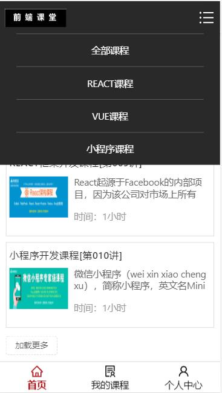
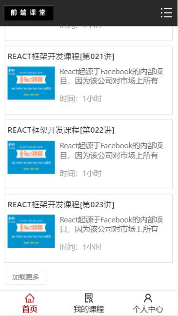
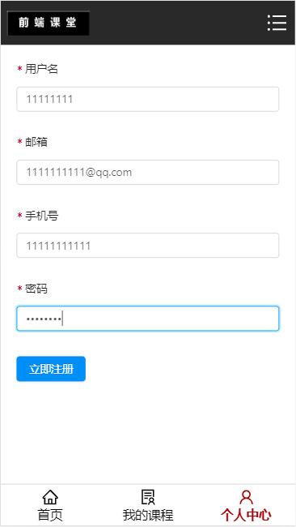
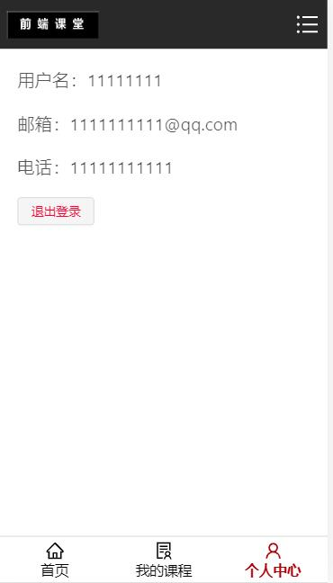
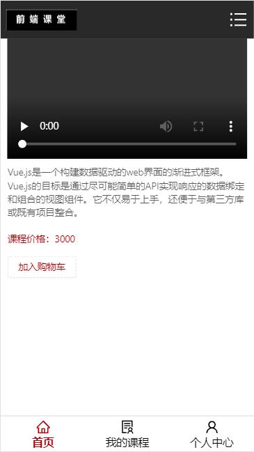
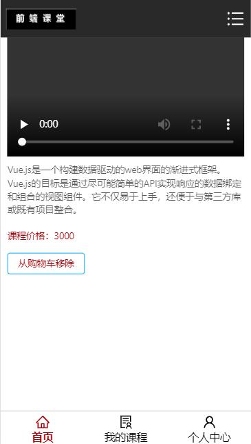
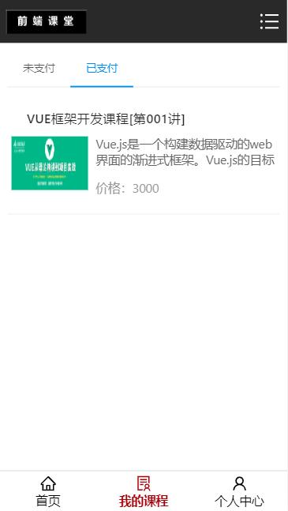
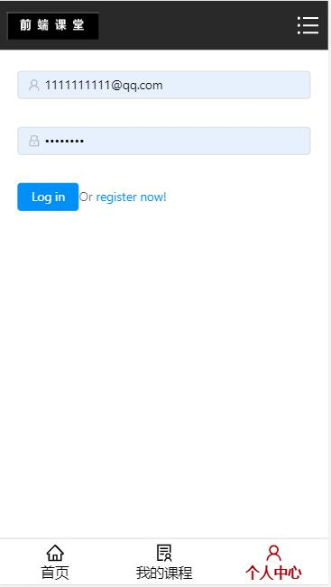

# React+Express实现前端课堂WebAPP

> 项目地址：https://github.com/yanzi1007/-APP

> 项目简介：前端课堂WebApp是一款用React全家桶实现的课程购买App，主要由三个模块组成：首页模块，我的课程模块，个人中心模块。首页模块包含课程列表组件、课程详情组件； 我的课程模块包含已支付组件、未支付组件 ；个人中心模块包括注册组件、登录组件、登录后的用户信息组件、未登录提示组件。主要实现了登录、注册、加载更多、加入/移除购物车、删除、支付等功能。

> 技术栈：前端：React/React-redux/React-router-dom/antd/ES6 后台：Node.js/Express

## 项目截图

* 首页(首页包含课程筛选和加载更多功能)

* 点击React筛选

* 注册页面

* 注册成功后的用户信息详情页

* 点击课程进入课程详情页面

* 在课程详情页点击加入购物车后的页面

* 我的课程页

* 点击支付后的已支付页面

* 未登录情况下:登录页面

* 未登录下的用户信息页面

